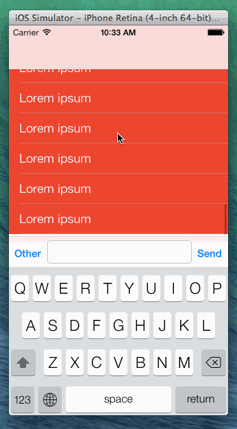

RDRStickyKeyboardView
=====================

Replication of iMessage's text input behavior on iOS 7 (`UIScrollViewKeyboardDismissModeInteractive` + persistent `inputAccessoryView`).

## What does it do
In the chat view of Apple's iMessage app, it is possible to interactively dismiss the keyboard. This feature has been introduced publicly in iOS 7 by means of the `keyboardDismissMode` property on `UIScrollView` and the corresponding enum values. 

Disregarding the new `keyboardDismissMode`, it has always been tough to have a `UITextView` visible when it is not the first responder, while having it stick to the keyboard as well when it is the first responder. The new `keyboardDismissMode` does not solve this issue. `RDRStickyKeyboardView` is a `UIView` subclass that hosts a `UIScrollView` instance (or subclass) and a text input view stuck at the bottom. When the user taps the text input view, it animates upwards alongside the keyboard. The user can subsequently drag the keyboard away while the input view follows and falls back into place when the user has stopped dragging. As an added bonus, the input view provided by `RDRStickyKeyboardView` is auto-growing.

## How does it work
`RDRStickyKeyboardView` uses two instances of the custom `RDRKeyboardInputView` class (let's call them A and B) that acts as the input view and contains a `UIButton` on the left, a `UITextView` in the middle, and a `UIButton` on the right. Instance A is always positioned at the bottom of the view, B is the `inputAccessoryView` of A's `UITextView`. As soon as A's `UITextView` becomes the first responder, the first responder status is handed over to B, which is glued to the top of the keyboard. The text entered into the `UITextView` instances of both input views A and B is synchronized.

## How to use
Check out the sample project to learn more.

```objectivec
UITableView *tableView = ...;
RDRStickyKeyboardView *keyboardView = [[RDRStickyKeyboardView alloc] initWithScrollView:tableView];
keyboardView.frame = self.view.bounds;
keyboardView.autoresizingMask = UIViewAutoresizingFlexibleHeight|UIViewAutoresizingFlexibleWidth;
[self.view addSubview:keyboardView];
```



## Requirements
* ARC
* iOS 7

## Known issues
* The keyboard's inputAccessoryView updates after the device's orientation has changed, instead of during the rotation
* The keyboard is visible at all times when editing, also with an external keyboard connected

## License
The code is licensed under the MIT license. See the file `LICENSE` for details.
